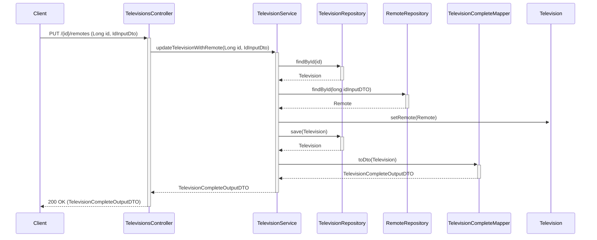

````mermaid
sequenceDiagram
    participant Client
    participant TelevisionsController
    participant TelevisionService
    participant TelevisionRepository
    participant CIModuleRepository
    participant TelevisionCompleteMapper
    Client ->>+ TelevisionsController: PUT /{id}/cimodules (long id, IdInputDto)
    TelevisionsController ->>+ TelevisionService: updateTelevisionWithCIModule(Long id, IdInputDto)
    TelevisionService ->>+ TelevisionRepository: findById(id)
    TelevisionRepository -->>- TelevisionService: Television
    TelevisionService ->>+ CIModuleRepository: findById(long idInputDTO)
    CIModuleRepository -->>- TelevisionService: CIModule
    TelevisionService ->>+ Television: setCiModule(CiModule)
    TelevisionService ->>+ TelevisionRepository: save(Television)
    TelevisionRepository -->>- TelevisionService: Television
    TelevisionService ->>+ TelevisionCompleteMapper: toDto(Television)
    TelevisionCompleteMapper -->>- TelevisionService: TelevisionCompleteOutputDTO
    TelevisionService -->>- TelevisionsController: TelevisionCompleteOutputDTO
    TelevisionsController -->>- Client: 200 OK (TelevisionCompleteOutputDTO)


````


````mermaid
sequenceDiagram
    participant Client
    participant TelevisionsController
    participant TelevisionService
    participant TelevisionRepository
    participant WallBracketRepository
    participant TelevisionCompleteMapper
    Client ->>+ TelevisionsController: PUT /{id}/wallbrackets (long id, List<IdInputDto)))
    TelevisionsController ->>+ TelevisionService: updateTelevisionWithWallBracket(Long id, IdInputDtO)
    TelevisionService ->>+ TelevisionRepository: findById(id)
    TelevisionRepository -->>- TelevisionService: Television
    loop for each IdInputDto in List<IdInputDto>
        TelevisionService ->>+ WallBracketRepository: findById(idInputDto.getId())
        WallBracketRepository -->>- TelevisionService: WallBracket
    end
    TelevisionService->>+Television: setWallBrackets(List<WallBracket>)
    TelevisionService ->>+ TelevisionRepository: save(Television)
    TelevisionRepository -->>- TelevisionService: Television
    TelevisionService ->>+ TelevisionCompleteMapper: toDto(Television)
    TelevisionCompleteMapper -->>- TelevisionService: TelevisionCompleteOutputDTO
    TelevisionService -->>- TelevisionsController: TelevisionCompleteOutputDTO
    TelevisionsController -->>- Client: 200 OK (TelevisionCompleteOutputDTO)
````