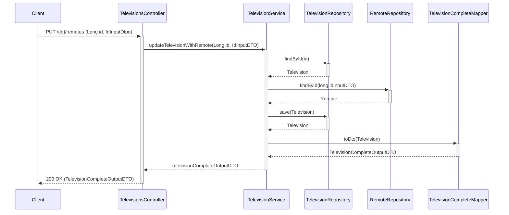

```mermaid
sequenceDiagram
    participant Client
    participant TelevisionsController
    participant TelevisionService
    participant TelevisionRepository
    participant RemoteRepository
    participant TelevisionCompleteMapper
    Client ->>+TelevisionsController: PUT /{id}/remotes (Long id, IdInputDtpo)
    TelevisionsController ->>+TelevisionService: updateTelevisionWithRemote(Long id, IdInputDTO)
    TelevisionService ->>+ TelevisionRepository: findById(id)
    TelevisionRepository -->>- TelevisionService: Television
    TelevisionService ->>+ RemoteRepository: findById(long idInputDTO)
    RemoteRepository -->>- TelevisionService: Remote
    TelevisionService ->>+ TelevisionRepository: save(Television)
    TelevisionRepository -->>- TelevisionService: Television
    TelevisionService ->>+ TelevisionCompleteMapper: toDto(Television)
    TelevisionCompleteMapper -->>- TelevisionService: TelevisionCompleteOutputDTO
    TelevisionService -->>- TelevisionsController: TelevisionCompleteOutputDTO
    TelevisionsController -->>- Client: 200 OK (TelevisionCompleteOutputDTO)
```